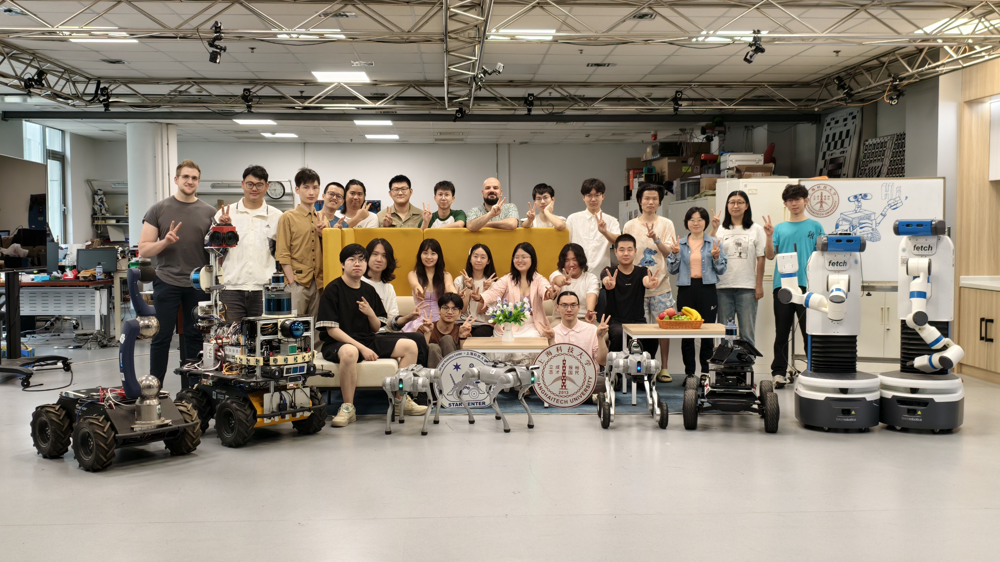
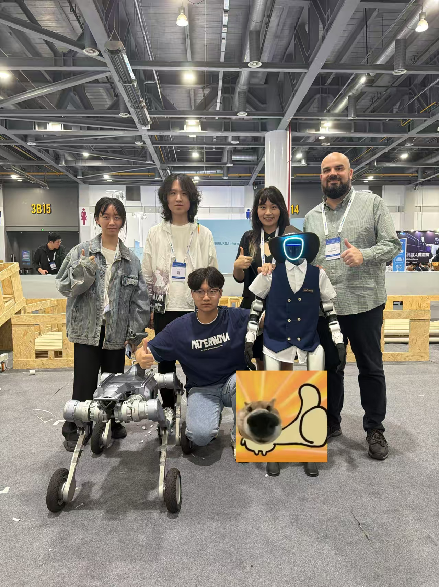
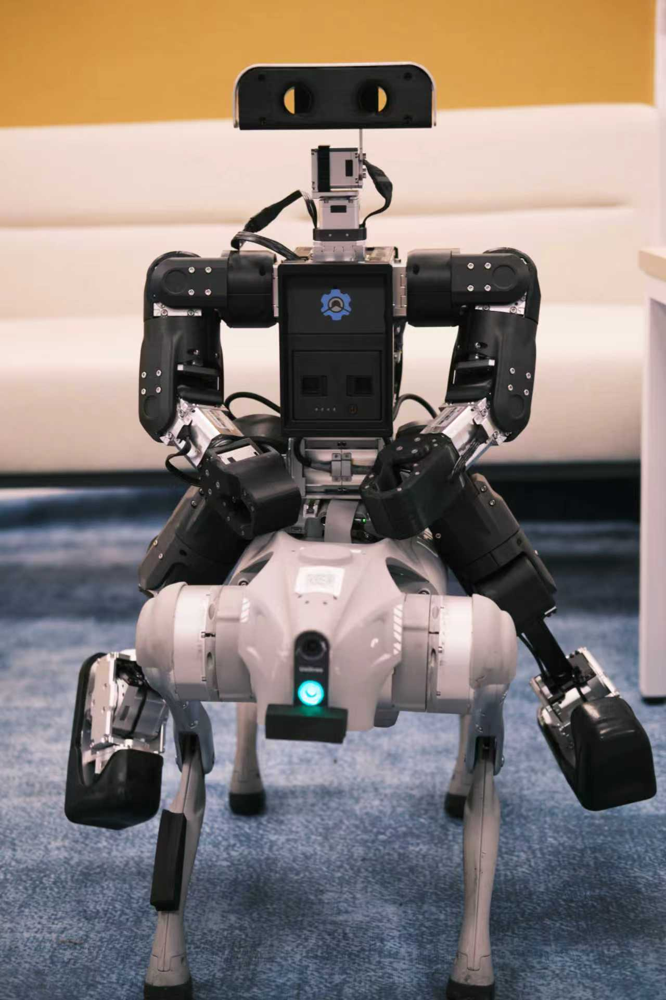
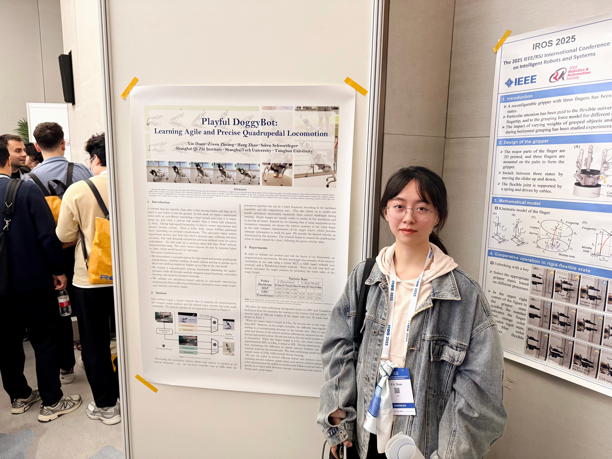
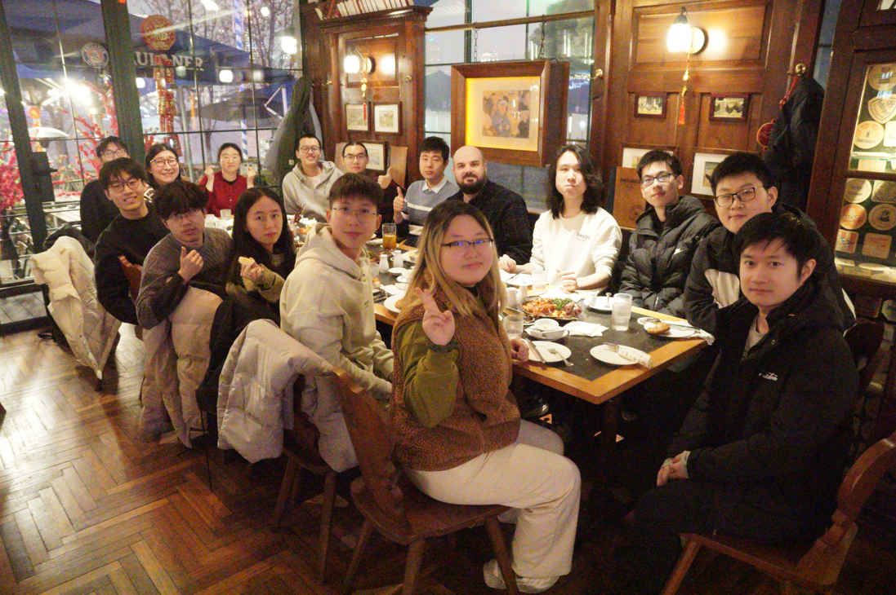
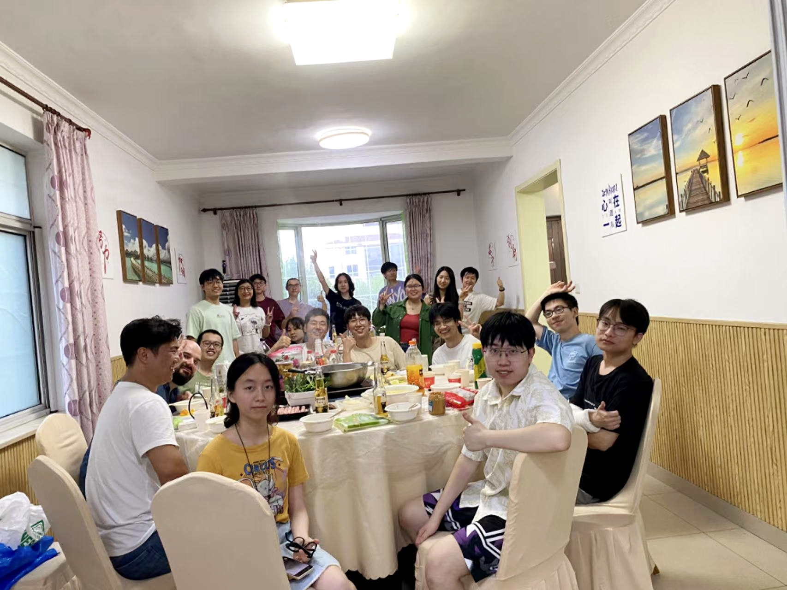
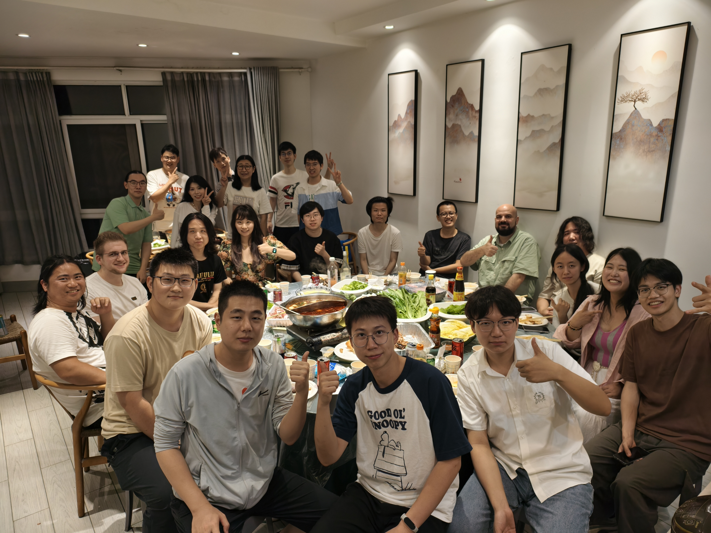
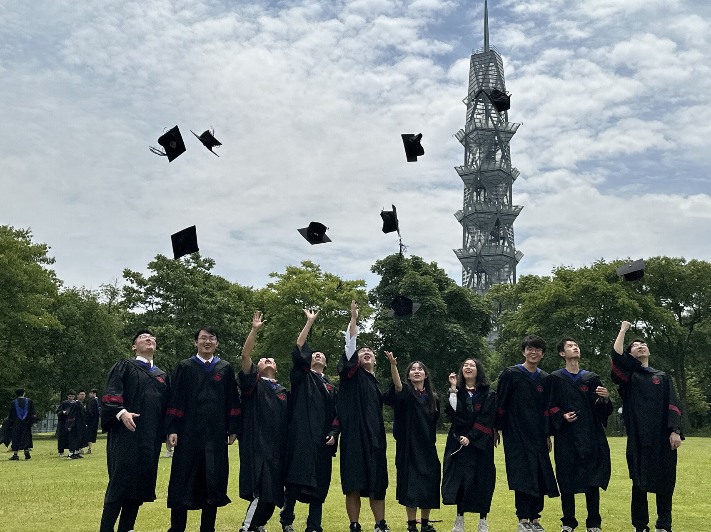
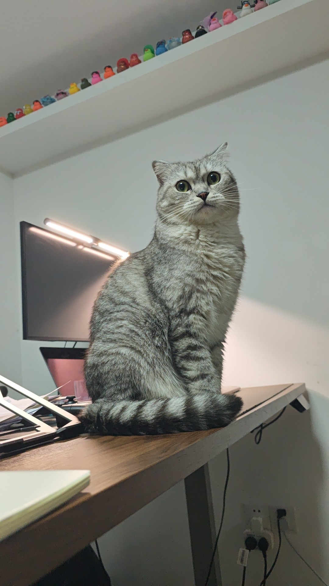
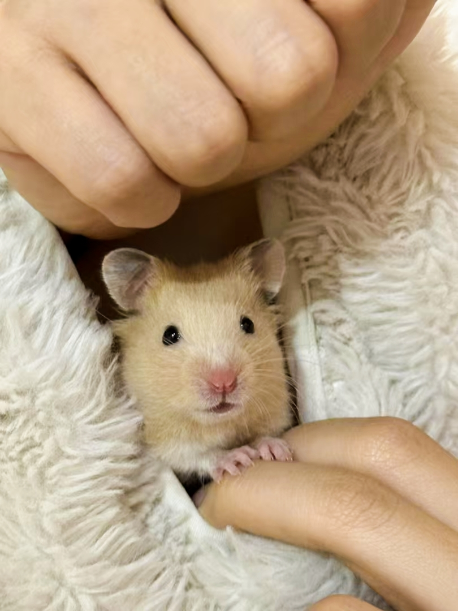

你好！我是段欣，一名对未来机器人如何感知、学习并与物理世界交互充满好奇的探索者。目前，我正在上海科技大学的MARS Lab 攻读硕士学位，并在 Sören Schwertfeger 教授的指导下，从事具身智能（Embodied AI）的研究，并希望能为领域的中文社区贡献一份力量。毕业后，我也将继续参与具身智能领域的工作。

### 关于 Mars Lab

我很自豪能成为 MARS Lab 的一员，这是一个充满活力、协作紧密且互帮互助的大家庭。实验室的研究方向涵盖移动机器人自主导航、强化学习运动控制及机器人移动操作等。

Sören 教授不仅为我们提供专业的学术指导和顶尖的实验设备，更给予我们高度的研究自主性。我们有机会自由组队，探索自己感兴趣的课题。几乎每周我们都会自发组织氛围轻松的学术圆桌，分享最新的科研成果，探讨领域的前沿进展。

更可贵的是，MARS Lab 像一个真正的“家”。教授和实验室格外关注成员们的身心健康与个人发展。除了科研，我们经常组织羽毛球、篮球、桌游和聚餐等活动。每年两次的大型 party更是我们的传统，已经毕业的学长学姐和访问学生们“回家”和我们相聚在一起。在这里的每一天，都充满了挑战与欢乐。

### 我的学术足迹

我的学术之旅始于上海科技大学，在这里我完成了计算机科学与技术的本科学习。上科大开放、前沿的学术氛围为我打下了坚实的理论基础，也鼓励我不断探索未知。我很感激在这里遇到的良师益友。

研一期间，我有幸在上海期智研究院 赵行教授 课题组进行实习。在这里我接触到具身领域的前沿工作。我非常感激赵行老师的专业指导和组里同学的友好交流为我打开了具身智能研究的大门。

### 科研之外

科研之外，我喜欢探索生活中的各种乐趣，旅行、宠物、各种球类运动、桌游、烹饪等等。硕士三年，我度过了非常充实快乐的时光。

感谢我的家人和朋友们一直以来的支持和鼓励！感谢所有善良和有爱的小伙伴！